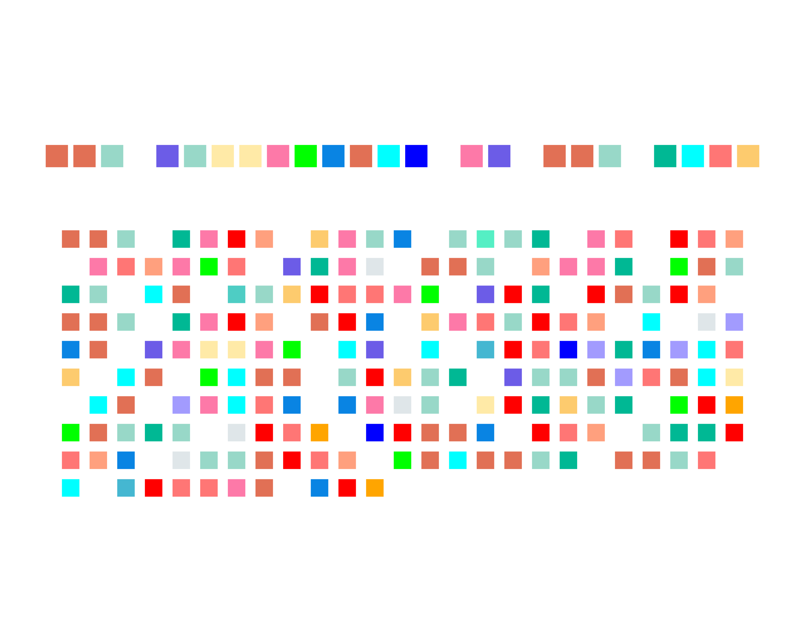
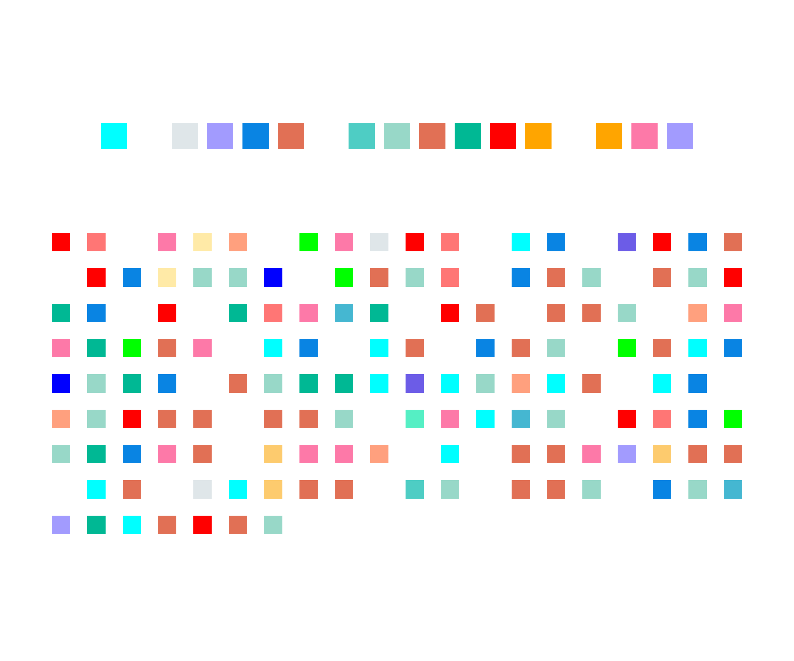

# Literary Data Art with R and ggplot2

As a Data Visualisation Fellow at the The Center for Digital Scholarship, Regenstein Library, I teach a series of workshops on various data visualisation tools and techniques, using my favourite programming tool - R. This repository is a self-sufficient guide to create your own 'data art' using the library ggplot2 in R Studio. Turn literary quotes into custom data visualizations that belong on your wall. In the workshop, using R and ggplot2, we analyze chosen text and crafted beautiful, print-ready art pieces that revealed hidden patterns in words.




Read through the rest of the guide to learn the grammar of graphics (ggplot2) and get started with data visualisation in R.

## About This Workshop

This workshop introduces the intersection of data visualization and art, demonstrating how R and ggplot2 can transform literary text into stunning visual patterns. Inspired by author Celeste Ng's visualization of Annie Dillard's *The Writing Life*, this project maps each letter of the alphabet to a distinct color, converting beloved prose into a grid of color-coded blocks that reveal hidden structures and rhythms within the text.

**Workshop Details:**
- **Instructor:** Khushi Desai
- **Institution:** Center for Digital Scholarship, Regenstein Library, The University of Chicago
- **Date:** November 7, 2025
- **Level:** Beginner-friendly, open to undergraduates, graduate students, post-docs and faculty members across all disciplines. 

## What You'll Learn

1. **The Grammar of Graphics (ggplot2)** - Understanding the philosophy behind ggplot2's layered approach to visualisation
2. **Data Processing** - Converting text into structured data for visualization
3. **Color Mapping** - Assigning unique colors to letters to create visual patterns
4. **Customization** - Adjusting parameters to create your perfect composition
5. **Print Preparation** - Exporting high-resolution artwork ready for printing

## Prerequisites

### Required Software
- R (version 4.0 or higher recommended)
- RStudio (optional but recommended)

### Required R Packages
```r
install.packages("ggplot2")
install.packages("dplyr")
install.packages("stringr")
```

### Comfort with the software
No prior programming experience required! This workshop is designed for beginners while still offering creative opportunities for experienced R users.

## Getting Started
1. **Clone this repository:**
   ```bash
   git clone git@github.com:khushineedssleep/Data-Art-Workshop.git
   ```

2. **Open the QMarkdown file:**
   - `ggplotworkshop.qmd` - Complete workshop code in a quarto markdown notebook
   - Use RStudio to open the project

3. **Follow along with the presentation:**
   - See `Khushi___GGPlot_presentation__1_.pdf` for slide deck

## The Process

### Step 1: Choose Your Text
Select a meaningful quote, poem, or prose passage. Examples:
- Opening lines from your favorite novel
- A beloved poem
- An inspirational quote
- Song lyrics (note: be mindful of the length)

### Step 2: Map Letters to Colors
Each letter of the alphabet gets assigned a unique color, creating a visual signature for your text:

```r
letter_colors <- c(
  a = "red", b = "#4ECDC4", c = "#45B7D1", 
  d = "#FFA07E", e = "#98D8C8", ...
)
```

### Step 3: Process the Text
The script converts your text into a grid format where each character occupies a position:
- Define characters per row (adjust for your desired composition)
- Split text into individual characters
- Assign coordinates for plotting

### Step 4: Create Your Visualization
Using ggplot2's `geom_point()` with custom parameters:
- Square shapes (`shape = 15`)
- Color mapping based on your letter-color dictionary
- Precise positioning with `coord_equal()`
- Clean aesthetic with `theme_void()`

### Step 5: Export for Printing
Save your artwork in high resolution:

```r
ggsave("i_must_betray_you.png", text_art, width = 12, height = 10, dpi = 300, bg = "white")
```

## Example Outputs

### The Fellowship of the Ring (J.R.R. Tolkien)
Visualizing the iconic opening passage reveals the rhythmic repetition of key phrases and the structural beauty of Tolkien's prose.

### I Must Betray You (Ruta Sepetys)
This haunting opening scene transforms into a color grid that captures the tension and brevity of the dialogue.

## Customization Tips

### Adjusting Your Composition
- **Characters per row:** Lower numbers create taller, narrower pieces; higher numbers create wider compositions
- **Point size:** Experiment with `size` parameter (7-15 works well)
- **Shape:** Try different shapes (15 = square, 16 = circle, 17 = triangle)
- **Margins:** Adjust plot margins for framing

### Print Specifications
- **Minimum DPI:** 300 for professional quality
- **Recommended sizes:** 12"×14", 16"×20", or 18"×24" for wall art
- **Background:** White background prints better than transparent
- **File format:** PNG or PDF for best quality

## Workshop Resources

- **Presentation Slides:** `Khushi___GGPlot_presentation__1_.pdf`
- **R Script:** `ggplotworkshop.qmd` (actual script)
- **Example Outputs:** See `fellowship_of_the_ring.png` and `I_must_betray_you.png`
- **ggplot2 Cheatsheet:** https://rstudio.github.io/cheatsheets/data-visualization.pdf


## Contributing

This is a learning resource! If you:
- Create an interesting variation
- Develop a new feature
- Find a bug
- Have teaching suggestions

Please feel free to open an issue or submit a pull request.

## License

This workshop material is available for educational purposes. Please credit appropriately if you use these materials in your own teaching or presentations.

## Contact

**Khushi Desai**  
Email: khushi@uchicago.edu  
Institution: University of Chicago

---

## Acknowledgments

- **Celeste Ng** for the original inspiration
- **Hadley Wickham** for ggplot2 and the tidyverse
- **Dr Ryan McShane** for a being a wonderful mentor and original brain behind this project!
- **University of Chicago Library** for supporting data literacy workshops
- **All workshop participants** who bring their creativity to these visualizations

---

*"Not sure if it's data visualization or just modern art" - and that's exactly the point!* 
