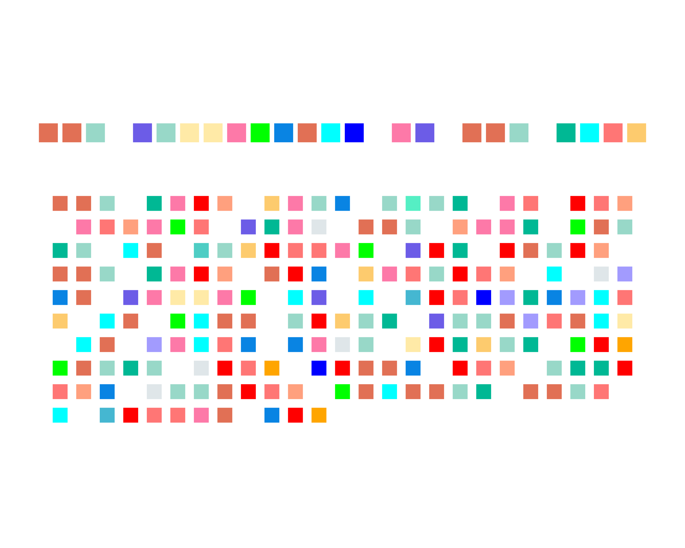
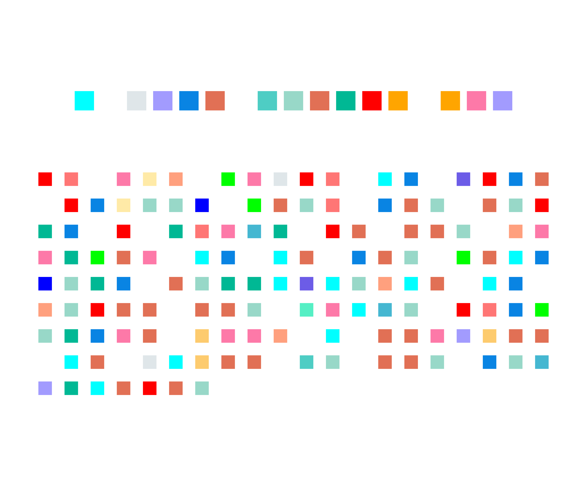

# Literary Data Art with R and ggplot2

> Turn literary quotes into custom data visualizations that belong on your wall. Using R and ggplot2, we'll analyze your chosen text and craft beautiful, print-ready art pieces that reveal hidden patterns in the words you love.




## 📖 About This Workshop

This workshop introduces the intersection of data visualization and art, demonstrating how R and ggplot2 can transform literary text into stunning visual patterns. Inspired by author Celeste Ng's visualization of Annie Dillard's *The Writing Life*, this project maps each letter of the alphabet to a distinct color, converting beloved prose into a grid of color-coded blocks that reveal hidden structures and rhythms within the text.

**Workshop Details:**
- **Presenter:** Khushi Desai
- **Institution:** University of Chicago, Regenstein Library, Center for Digital Scholarship
- **Date:** November 7, 2025
- **Level:** Beginner-friendly, open to undergraduates and graduate students

## 🎨 What You'll Learn

1. **The Grammar of Graphics (ggplot2)** - Understanding the philosophy behind ggplot2's layered approach to visualization
2. **Data Processing** - Converting text into structured data for visualization
3. **Color Mapping** - Assigning unique colors to letters to create visual patterns
4. **Customization** - Adjusting parameters to create your perfect composition
5. **Print Preparation** - Exporting high-resolution artwork ready for printing

## 🛠️ Prerequisites

### Required Software
- R (version 4.0 or higher recommended)
- RStudio (optional but recommended)

### Required R Packages
```r
install.packages("ggplot2")
install.packages("dplyr")
install.packages("stringr")
```

### Knowledge Level
No prior programming experience required! This workshop is designed for beginners while still offering creative opportunities for experienced R users.

## 🚀 Getting Started

1. **Clone this repository:**
   ```bash
   git clone https://github.com/yourusername/literary-data-art-workshop.git
   cd literary-data-art-workshop
   ```

2. **Open the R script or RMarkdown file:**
   - `data_art_workshop.R` - Complete workshop code
   - Or use RStudio to open the project

3. **Follow along with the presentation:**
   - See `Khushi___GGPlot_presentation__1_.pdf` for slide deck

## 📝 The Process

### Step 1: Choose Your Text
Select a meaningful quote, poem, or prose passage. Examples:
- Opening lines from your favorite novel
- A beloved poem
- An inspirational quote
- Song lyrics (note: be mindful of length)

### Step 2: Map Letters to Colors
Each letter of the alphabet gets assigned a unique color, creating a visual signature for your text:

```r
letter_colors <- c(
  a = "red", b = "#4ECDC4", c = "#45B7D1", 
  d = "#FFA07E", e = "#98D8C8", ...
)
```

### Step 3: Process the Text
The script converts your text into a grid format where each character occupies a position:
- Define characters per row (adjust for your desired composition)
- Split text into individual characters
- Assign coordinates for plotting

### Step 4: Create Your Visualization
Using ggplot2's `geom_point()` with custom parameters:
- Square shapes (`shape = 15`)
- Color mapping based on your letter-color dictionary
- Precise positioning with `coord_equal()`
- Clean aesthetic with `theme_void()`

### Step 5: Export for Printing
Save your artwork in high resolution:

```r
ggsave("my_artwork.png", width = 12, height = 14, 
       dpi = 300, bg = "white")
```

## 🎨 Example Outputs

### The Fellowship of the Ring (J.R.R. Tolkien)
Visualizing the iconic opening passage reveals the rhythmic repetition of key phrases and the structural beauty of Tolkien's prose.

### I Must Betray You (Ruta Sepetys)
This haunting opening scene transforms into a color grid that captures the tension and brevity of the dialogue.

## 🎯 Customization Tips

### Adjusting Your Composition
- **Characters per row:** Lower numbers create taller, narrower pieces; higher numbers create wider compositions
- **Point size:** Experiment with `size` parameter (7-15 works well)
- **Shape:** Try different shapes (15 = square, 16 = circle, 17 = triangle)
- **Margins:** Adjust plot margins for framing

### Color Palette Ideas
- **Monochromatic:** Shades of a single color
- **Gradient:** Create smooth color transitions
- **Thematic:** Match colors to text mood (warm colors for romantic text, cool colors for melancholic)
- **Brand colors:** Use your favorite brand's color scheme

### Print Specifications
- **Minimum DPI:** 300 for professional quality
- **Recommended sizes:** 12"×14", 16"×20", or 18"×24" for wall art
- **Background:** White background prints better than transparent
- **File format:** PNG or PDF for best quality

## 📚 Workshop Resources

- **Presentation Slides:** `Khushi___GGPlot_presentation__1_.pdf`
- **R Script:** `data_art_workshop.R` (your codebook)
- **Example Outputs:** See `fellowship_of_the_ring.png` and `I_must_betray_you.png`
- **ggplot2 Cheatsheet:** https://rstudio.github.io/cheatsheets/data-visualization.pdf

## 🌟 Inspiration & Further Reading

- **Celeste Ng's Original Work:** Ng's visualization of *The Writing Life* pioneered this approach to literary data art
- **ggplot2 Documentation:** https://ggplot2.tidyverse.org/
- **The Grammar of Graphics:** Hadley Wickham's implementation of Leland Wilkinson's theory
- **Data Art Community:** Explore #dataviz and #rstats on social media for inspiration

## 🎓 Learning Outcomes

By the end of this workshop, you will be able to:
- ✅ Understand the grammar of graphics philosophy in ggplot2
- ✅ Process text data for visualization purposes
- ✅ Create custom color mappings for categorical data
- ✅ Build layered visualizations using ggplot2
- ✅ Export publication-quality graphics from R
- ✅ Iterate and experiment with your own creative visions

## 💡 Project Ideas

Take this further! Here are some creative extensions:

1. **Book Comparison:** Visualize openings from multiple books by the same author
2. **Poetry Analysis:** Compare different poems to see structural differences
3. **Language Study:** Visualize text in different languages to see letter frequency patterns
4. **Personal Journals:** Create art from your own writing
5. **Song Lyrics:** Map your favorite songs (great gift ideas!)
6. **Historical Texts:** Visualize famous speeches or declarations

## 🤝 Contributing

This is a learning resource! If you:
- Create an interesting variation
- Develop a new feature
- Find a bug
- Have teaching suggestions

Please feel free to open an issue or submit a pull request.

## 📄 License

This workshop material is available for educational purposes. Please credit appropriately if you use these materials in your own teaching or presentations.

## 📬 Contact

**Khushi Desai**  
Email: khushi@uchicago.edu  
Institution: University of Chicago, Center for Digital Scholarship

---

## 🙏 Acknowledgments

- **Celeste Ng** for the original inspiration
- **Hadley Wickham** for ggplot2 and the tidyverse
- **University of Chicago Library** for supporting data literacy workshops
- **All workshop participants** who bring their creativity to these visualizations

---

*"Not sure if it's data visualization or just modern art" - and that's exactly the point!* 🎨📊